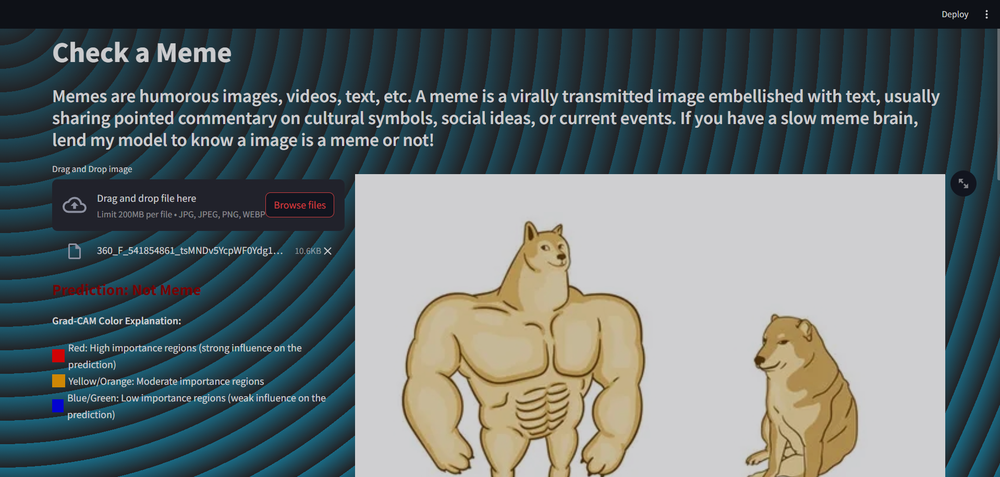
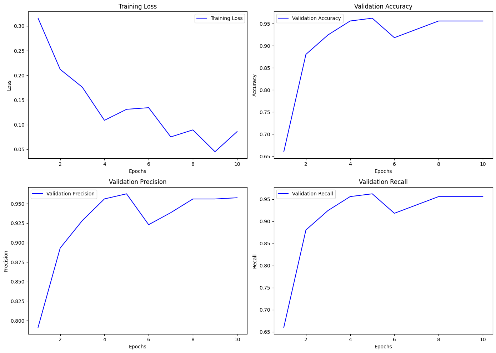
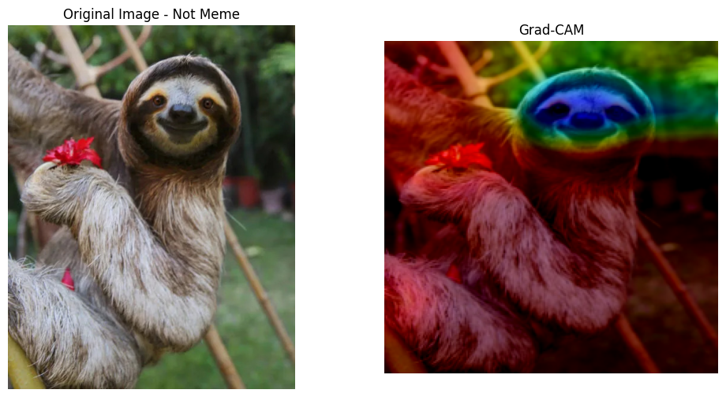

# Meme Classifier Web App

This web application is designed to classify images as "Meme" or "Not Meme" using a pre-trained DenseNet121 model. Additionally, it generates Grad-CAM visualizations to highlight the regions of the image that the model considered important for its prediction.

## Features

- **Image Classification:** Upload an image and the app will classify it as a meme or not.
- **Grad-CAM Visualization:** View a heatmap overlay on the image that shows which parts of the image were most important for the classification.
- **Streamlit Interface:** A user-friendly web interface built with Streamlit.
- **Custom Background:** The app features a custom background image for a better visual experience.

## Getting Started

### Prerequisites

- Python 3.7 or higher
- Streamlit
- Torch
- Pillow
- Numpy

### Installation

1. Clone the repository:
    ```sh
    git clone https://github.com/yourusername/meme-classifier.git
    cd meme-classifier
    ```

2. Install the required packages:
    ```sh
    pip install -r requirements.txt
    ```

3. Download the pre-trained model (`best_model.pth`) and place it in the project directory.

### Usage

1. Run the Streamlit app:
    ```sh
    streamlit run app.py
    ```

2. Open your web browser and go to `http://localhost:8501`.

3. Upload an image and get the classification along with the Grad-CAM visualization.

### webapp image



## DenseNet121

DenseNet121 is a densely connected convolutional network. DenseNet121 improves the flow of information and gradients throughout the network, making the model more accurate and efficient. It is particularly effective for image classification tasks due to its deep architecture and dense connections between layers.

## Grad-CAM

Grad-CAM (Gradient-weighted Class Activation Mapping) is a technique used to visualize the important regions of an image for a specific class prediction. It works as follows:

1. **Forward Pass:** Perform a forward pass to compute the activations of the convolutional layers and the final output.
2. **Backward Pass:** Compute the gradients of the predicted class with respect to the feature maps of the convolutional layer.
3. **Weight Calculation:** Compute the weights by averaging the gradients over all the pixels in the feature maps.
4. **Heatmap Generation:** Create a heatmap by performing a weighted sum of the feature maps, followed by a ReLU activation to retain only positive values.
5. **Overlay:** The heatmap is resized to match the input image dimensions and overlaid on the original image to highlight the important regions.

### Grad-CAM Color Explanation

-  **Red:** High importance regions (strong influence on the prediction)
-  **Yellow/Orange:** Moderate importance regions
-  **Blue/Green:** Low importance regions (weak influence on the prediction)

In the visualizations, these colors indicate the level of influence a region has on the final prediction, helping to understand which parts of the image are most critical for the model's decision-making process.


### Metrics

- **Accuracy:** 97%
- **Precision:** 96%
- **Recall:** 95%
- **F1 Score:** 96%
#### plots
 

## Example Predictions

### Meme Prediction


### Not Meme Prediction



## License

This project is licensed under the MIT License. See the [LICENSE](LICENSE) file for details.
